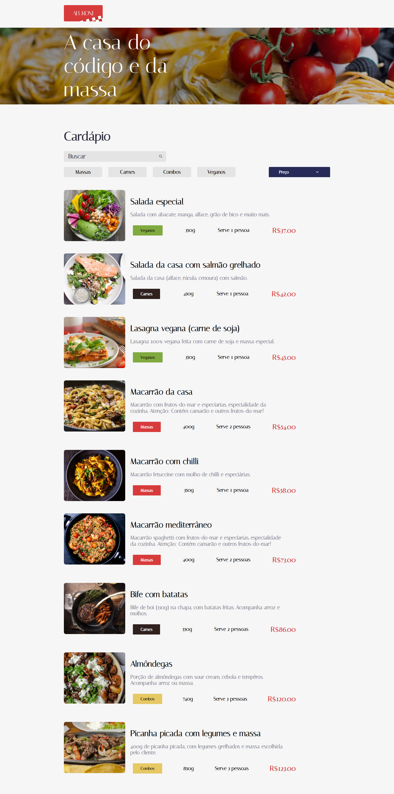

# Curso React:lidando com arquivos estáticos

- Neste curso meu objetivo foi buscar mais conhecimento em React com TypeScript

# Projeto Aluroni

## Para abrir o projeto em sua máquina você precisará dos comandos

### `npm install`
### `npm start`

📌 - O projeto também está disponível no link abaixo da Vercel 😊

### Projeto Aluroni

